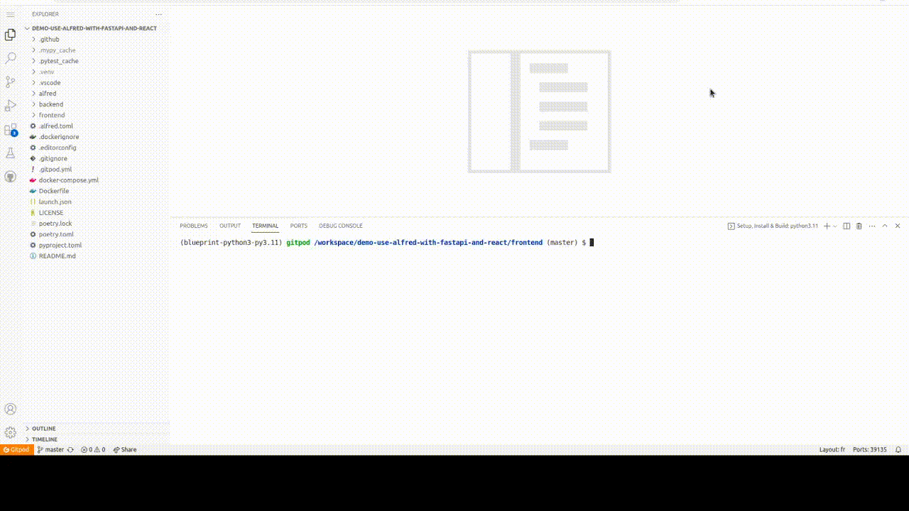

## Demo - Use alfred as build agent with fastapi and react

[](https://github.com/FabienArcellier/demo-use-alfred-with-fastapi-and-react/actions/workflows/main.yml)

This repository is a demo to show how to use alfred as build agent with fastapi and react. A blog article accompanies this repo. (coming soon)

## Getting started (Lazy mode)

[](https://gitpod.io/#https://github.com/FabienArcellier/demo-use-alfred-with-fastapi-and-react)

1. show documentation for alfred's commands

```bash
alfred --help
```

2. run the commands you want, like ``alfred ci``



## Getting started (In local)

1. clone this repository

```bash
git clone https://github.com/FabienArcellier/demo-use-alfred-with-fastapi-and-react.git
```

2. install dependencies with poetry

```bash
poetry install
```

3. show documentation for alfred's commands

```bash
alfred --help
```

4. run the commands you want, like ``alfred ci``

